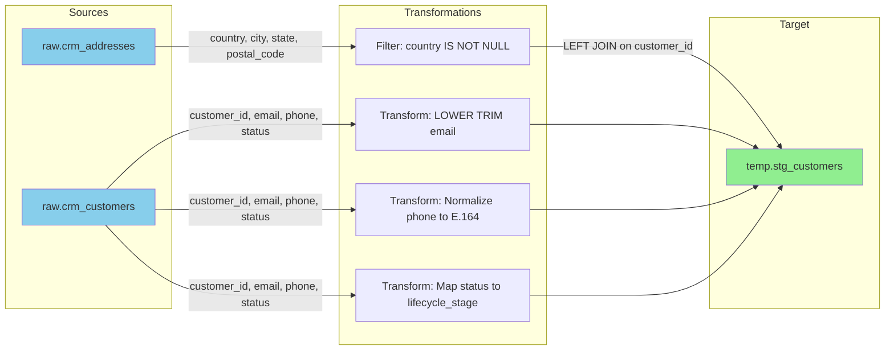

# Spec-Driven Data Pipelines: An Emerging Approach to Data Engineering with AI

## Introduction: A Shift in How Data Engineers Work

With the introduction of generative AI, data engineers are discovering new ways of building data pipelines. The change isn't that code generation becomes trivial or negligible - rather, **where engineers spend their time is fundamentally shifting**.

Previously, data engineers spent significant effort on:
- Writing SQL transformations line by line
- Translating business requirements into platform-specific code
- Debugging syntax errors and fixing typos
- Maintaining repetitive boilerplate code

Now, we're seeing engineers spend more time on:
- **Building specialized AI agents** customized to generate code that meets the organization's requirements and standards
- **Providing AI agents with extensive knowledge** about the existing framework, organizational rules, data models, and platform-specific patterns
- **Designing comprehensive testing frameworks** that can quickly validate AI-generated code
- **Reviewing AI-generated outputs** - both the specs and the code - to ensure quality and correctness

**The key insight:** Engineers become architects of the system that generates code, rather than writing every line themselves. The AI agent generates code that fits into the organization's existing framework and processes. The engineer reviews the agent's output, validates it through automated tests, and provides feedback to improve the system.

This is what we see as an emerging way of writing data pipelines.

## The Challenge: From Ambiguity to Execution

Even with AI assistance, data engineering teams face a recurring challenge: business requirements arrive as lengthy English documents describing complex data transformations. The questions remain:
- How do we ensure AI-generated code actually implements what the business asked for?
- How do we validate correctness quickly enough to enable rapid iteration?
- How do we make AI-generated specs and code reviewable by humans (and business stakeholders)?

Traditional approaches struggle with this disconnect:
- Business requirements written in prose leave room for interpretation
- Manual translation to code introduces errors and inconsistencies
- Multiple data platforms (DBT, Dataform, PySpark) require different implementations
- Testing and validation happen too late in the development cycle
- AI-generated JSON specs are machine-readable but difficult for humans to review

## A New Approach: The Spec-Driven Pipeline

What if we could introduce an intermediate layer between business requirements and code - a structured, machine-readable specification that eliminates ambiguity and enables automated code generation?

This is the core idea behind the **spec-driven pipeline approach**:

```
Business Requirements (English)
          ↓
    [LLM Conversion]
          ↓
Technical Specification (JSON)
          ↓
    [LLM Generation - Parallel Tracks]
          ↓
    ┌──────────────────────────────────────────────────────┐
    │                         │                            │
    ↓                         ↓                            ↓
Platform-Specific Code   Test Specifications   Visual Documentation
(DBT/Dataform/PySpark)  (Assertions/Fixtures)  (Mermaid/Diagrams)
    │                         │                            │
    └──────────────────────────────────────────────────────┘
          ↓
    [Automated Testing]
          ↓
    [Human Review & Validation]
    (Reviews visual diagrams + test results)
          ↓
Production Pipeline
```

## The Multi-Stage Process

### Stage 1: Business Requirements

Let's start with a typical business requirement. Here's a real example:

```markdown
## Model: stg_customers (schema: temp)
Sources: raw.crm_customers, raw.crm_addresses

Column mapping:
| target_column   | from_table    | from_column | transform                    |
|-----------------|---------------|-------------|------------------------------|
| customer_id     | crm_customers | customer_id |                              |
| email           | crm_customers | email       | LOWER(TRIM({from}))          |
| phone_e164      | crm_customers | phone       | [complex phone normalization]|
| lifecycle_stage | crm_customers | status      | [case statement mapping]     |
| country         | crm_addresses | country     |                              |

Joins:
| left_table    | right_table   | type | condition                                    |
|---------------|---------------|------|----------------------------------------------|
| crm_customers | crm_addresses | LEFT | crm_customers.customer_id = crm_addresses... |

Filters:
| applies_to    | predicate           | rationale                |
|---------------|---------------------|--------------------------|
| crm_addresses | country IS NOT NULL | drop incomplete addresses|
```

This is a structured business requirement, but it's still in markdown format designed for humans. An LLM can read this, but it requires interpretation.

### Stage 2: Technical Specification (JSON)

The first LLM step converts the business requirement into an unambiguous JSON specification:

```json
{
  "name": "stg_customers",
  "layer": "staging",
  "sources": ["raw.crm_customers", "raw.crm_addresses"],
  "column_mapping": [
    {
      "target_column": "customer_id",
      "type": "INT64",
      "from_table": "crm_customers",
      "from_column": "customer_id",
      "transform": null,
      "nullable": false,
      "tests": ["not_null", "unique"],
      "description": "Primary business key"
    },
    {
      "target_column": "email",
      "type": "STRING",
      "from_table": "crm_customers",
      "from_column": "email",
      "transform": "LOWER(TRIM({from}))",
      "nullable": false,
      "tests": ["not_null"],
      "description": "Standardized email"
    }
  ],
  "joins": [
    {
      "left_table": "crm_customers",
      "right_table": "crm_addresses",
      "type": "LEFT",
      "condition": "crm_customers.customer_id = crm_addresses.customer_id"
    }
  ],
  "filters": [
    {
      "applies_to": "crm_addresses",
      "predicate": "country IS NOT NULL",
      "rationale": "drop incomplete addresses"
    }
  ],
  "constraints": {
    "primary_key": "customer_id"
  }
}
```

**Why is this powerful?**
- Every column mapping is explicit (source table, source column, target column, transformation)
- Data types are declared unambiguously
- Join conditions are precisely specified
- Tests and constraints are machine-readable
- No room for interpretation or guesswork

**The Critical Challenge: Ensuring Spec Accuracy Through Human Review**

The JSON spec is the **source of truth** that drives all code generation. If the spec misinterprets the business requirement, all generated code will be wrong - no matter how perfect the code generation is.

**This makes human review of the spec absolutely critical.** Before any code is generated, stakeholders must confirm: *Does this spec.json correctly translate the business requirement into technical specification?*

But here's the problem: **JSON is not human-friendly.** A 500-line JSON file with nested structures is hard for business stakeholders to review. Data engineers can parse it, but business users struggle.

**The Solution: Deterministic Conversion to Human-Reviewable Formats**

This project provides tools to convert `spec.json` into multiple human-readable formats:

1. **Excel workbooks** - for business stakeholder review
2. **CSV files** - for version control and programmatic processing
3. **Mermaid diagrams** - for visual data flow understanding

**Why deterministic (non-LLM) conversion is critical:**

Here's a critical insight: **Don't use LLMs to generate visualizations from the JSON spec.** That introduces unnecessary risk of errors and inconsistencies.

Instead, use **deterministic, programmatic generation** (e.g., Python scripts) to convert the structured JSON into human-readable formats. Since JSON is structured data, this conversion should be:
- **Deterministic**: Same JSON always produces the same diagram/Excel file
- **Reliable**: No hallucination or interpretation errors
- **Fast**: Instant generation without LLM calls
- **Verifiable**: Logic is in code, not in prompts
- **Perfect consistency**: What humans review is exactly what machines execute

### Spec Export Tools in This Project

This repository includes deterministic tools to export `spec.json` to reviewable formats:

```bash
# Generate Excel workbook for stakeholder review
python3 src/agentic_spec_pipeline/tools/spec_to_excel.py examples/technical_requirements/spec.json review.xlsx

# Generate CSV files for version control
python3 src/agentic_spec_pipeline/tools/spec_to_csv.py examples/technical_requirements/spec.json review_csv/

# Generate Mermaid diagrams for visual understanding
python3 src/agentic_spec_pipeline/tools/spec_to_diagram.py examples/technical_requirements/spec.json diagram.md

# Or generate all formats at once
./src/agentic_spec_pipeline/tools/export_spec.sh examples/technical_requirements/spec.json
```

**What these tools generate:**

**Excel Output (`review.xlsx`):**
- **Overview sheet**: Summary of all models
- **Individual model sheets**: Column mappings, transformations, joins, filters
- **All Columns sheet**: Complete data dictionary
- **Data Lineage sheet**: Dependencies and downstream usage

Perfect for business stakeholder review and approval.

**CSV Output (`review_csv/`):**
- `00_overview.csv` - Model inventory
- `01_all_columns.csv` - Complete data dictionary
- `02_all_transforms.csv` - All transformation logic
- `03_all_joins.csv` - Join definitions
- `04_all_tests.csv` - Data quality tests
- `05_data_lineage.csv` - Dependencies
- `model_*.csv` - Individual model details

Perfect for version control diffs and change tracking.

**Mermaid Diagram Output (`diagram.md`):**

For example, a Python script reads the JSON spec and generates visual diagrams like:



Or a simplified table view:

```markdown
## Pipeline: stg_customers

**Sources:** raw.crm_customers ⟵ LEFT JOIN ⟵ raw.crm_addresses

**Transformations:**
- email → LOWER(TRIM(email))
- phone → E.164 format
- status → lifecycle_stage mapping
- Filter addresses: country IS NOT NULL

**Output:** temp.stg_customers
**Primary Key:** customer_id
**Tests:** NOT NULL, UNIQUE on customer_id
```

**Benefits for Human Review:**
- **At-a-glance understanding** of data flow
- **Easy identification** of transformation logic
- **Quick validation** of join relationships
- **Accessible to non-technical stakeholders** (business users, analysts)
- **Better for documentation** and onboarding
- **Enables approval workflow**: Business stakeholders review Excel/diagrams and approve the spec before code generation

**The Complete Workflow with Human Review:**
```
Business Requirements (English)
    ↓
[LLM] Convert to Technical Spec
    ↓
spec.json (machine-readable, source of truth)
    ↓
[Deterministic Tools] Export to Human-Reviewable Formats
    ├─→ Excel workbook (for stakeholder review)
    ├─→ CSV files (for version control)
    └─→ Mermaid diagrams (for visual understanding)
    ↓
[HUMAN REVIEW - CRITICAL GATE]
    - Business stakeholders review Excel/diagrams
    - Validate: Does spec correctly represent requirements?
    - Approve or request changes
    ↓
[Only after approval]
    ↓
spec.json (approved)
    ↓
    ├─→ [LLM] Generate Platform Code (DBT/Dataform/PySpark)
    ├─→ [LLM/Script] Generate Test Specifications
    └─→ [Already generated] Documentation (Excel/CSV/Diagrams)
    ↓
[Automated Testing - Fast Feedback Loop]
    - Run tests locally (BigQuery emulator, unit tests)
    - Validate schema, transformations, business logic
    - Quick iteration: seconds to minutes
    ↓
[HUMAN REVIEW - SECOND GATE]
    - Review generated code
    - Review test results
    - Validate performance
    ↓
Production Deployment
```

**Critical Distinctions:**
- **Spec generation**: Uses LLMs (converts English to JSON)
- **Spec export (Excel/CSV/Diagrams)**: Uses deterministic scripts (no LLMs, no hallucination risk)
- **Code generation**: Uses LLMs (requires interpretation of spec into platform-specific syntax)
- **Test generation**: Can use LLMs or deterministic scripts
- **Test execution**: Automated, provides fast feedback

**Why Human Review of Specs is Critical:**

This is the **most important step** to get right. If the spec is wrong, all downstream generated code will be wrong.

The human review process ensures:
1. **Business requirement accuracy**: Does the spec.json correctly represent what the business asked for?
2. **Data lineage correctness**: Are source tables and joins specified correctly?
3. **Transformation logic validation**: Do transformations implement the intended business rules?
4. **Data quality standards**: Are appropriate tests and constraints defined?

**Using the exported formats:**
- **Excel workbook**: Share with business stakeholders for approval
- **CSV files**: Commit to version control to track changes over time
- **Mermaid diagrams**: Include in documentation, presentations, PRs

**Why this matters:**
- **JSON is the source of truth** - it's stored in version control, reviewed, and approved
- **Excel/CSV/Diagrams are for human convenience** - they help reviewers quickly understand the spec
- **Exports must be perfectly consistent** with JSON - any discrepancy creates confusion
- **Using deterministic scripts** ensures exports always match the JSON exactly
- **No hallucination risk** - Python can't misinterpret or creatively alter the spec

This way:
- **Machines** execute from the precise JSON
- **Humans** review using the clear visualizations (generated deterministically from JSON)
- **Perfect consistency** between what humans see and what machines execute
- **Fast iteration** is possible because review materials are instantly generated

### Stage 3: Code Generation

With the JSON spec in hand, an LLM can now generate platform-specific code with high accuracy. Here's the generated Dataform code:

```sql
config({
  type: "table",
  schema: "temp"
})
WITH
  crm_customers AS (
    SELECT
      customer_id,
      email,
      phone,
      status,
      created_at
    FROM
      `${ref('raw.crm_customers')}`
  ),
  crm_addresses AS (
    SELECT
      customer_id,
      country,
      city,
      state,
      postal_code
    FROM
      `${ref('raw.crm_addresses')}`
    WHERE
      country IS NOT NULL  -- Filter from spec
  ),
  joined AS (
    SELECT
      crm_customers.customer_id AS customer_id,
      LOWER(TRIM(crm_customers.email)) AS email,  -- Transform from spec
      CASE
        WHEN REGEXP_CONTAINS(REGEXP_REPLACE(crm_customers.phone, '[^0-9]', ''), r'^1?[0-9]{10}$')
          THEN CONCAT('+1', RIGHT(REGEXP_REPLACE(crm_customers.phone, '[^0-9]', ''), 10))
        WHEN REGEXP_CONTAINS(REGEXP_REPLACE(crm_customers.phone, '[^0-9]', ''), r'^[0-9]{11,15}$')
          THEN CONCAT('+', REGEXP_REPLACE(crm_customers.phone, '[^0-9]', ''))
        ELSE NULL
      END AS phone_e164,
      crm_addresses.country AS country,
      crm_addresses.city AS city,
      crm_customers.created_at AS created_at
    FROM
      crm_customers
      LEFT JOIN crm_addresses ON crm_customers.customer_id = crm_addresses.customer_id
  )
SELECT * FROM joined
```

The LLM follows the specification exactly:
- CTEs for each source table
- Filters applied where specified
- Joins configured per the spec
- Transformations applied to the correct columns
- Column aliases matching target names

### Stage 3b: Parallel Test Generation

At the same time the pipeline code is being generated, the LLM can also generate comprehensive test specifications. This happens in parallel, using the same JSON spec as the source of truth.

The test generation can be done:
1. **Using LLMs** to create test cases based on the specification
2. **Programmatically** by parsing the JSON spec and generating standard test patterns

Here's an example of LLM-generated test specifications:

```python
# Test specification for stg_customers
test_cases = [
    {
        "name": "test_customer_id_uniqueness",
        "type": "assertion",
        "query": """
            SELECT customer_id, COUNT(*) as cnt
            FROM stg_customers
            GROUP BY customer_id
            HAVING cnt > 1
        """,
        "expected_rows": 0,
        "description": "Ensure customer_id is unique"
    },
    {
        "name": "test_email_lowercased",
        "type": "transformation",
        "input_data": {
            "crm_customers": [
                {"customer_id": 1, "email": "TEST@EXAMPLE.COM", "status": "active"}
            ]
        },
        "expected_output": [
            {"customer_id": 1, "email": "test@example.com"}
        ],
        "description": "Verify email is lowercased"
    },
    {
        "name": "test_filter_null_countries",
        "type": "row_count",
        "query": """
            SELECT COUNT(*)
            FROM stg_customers
            WHERE country IS NULL
        """,
        "expected": "based on join with filtered addresses",
        "description": "Addresses with null countries should be filtered out"
    }
]
```

**Benefits of parallel test generation:**
- Tests are derived directly from the spec (same source of truth)
- Coverage is comprehensive and systematic
- Tests can run locally before cloud deployment
- Both positive and negative test cases can be generated
- Edge cases from the spec (nullable fields, transformations) are automatically covered

### Stage 4: Automated Testing

Once both the pipeline code and test specifications are generated, automated testing validates:
- **Schema tests**: Column names, types, nullability match the spec
- **Transformation tests**: Business logic is correctly implemented
- **Data quality tests**: Constraints and business rules are enforced
- **Integration tests**: Joins and filters work as expected

This can happen:
- **Locally** using BigQuery emulators or in-memory databases
- **In a dev environment** with synthetic data
- **In staging** with production-like data

### Stage 5: Human Review & Validation

**This is a critical, non-negotiable step.** Despite the automation, human engineers must review and validate:

**What to Review:**
1. **Spec Accuracy**: Does the JSON spec truly represent the business requirement?
2. **Code Quality**: Is the generated code performant, idiomatic, and maintainable?
3. **Test Coverage**: Are edge cases and business logic properly tested?
4. **Data Quality**: Do the results make business sense?
5. **Security & Compliance**: Are PII handling and access controls correct?

**Who Reviews:**
- Data engineers who understand the platform and performance implications
- Business stakeholders who can validate the logic matches requirements
- Data governance teams for compliance and security

**Review Criteria:**
```markdown
✓ Spec matches business requirements
✓ Generated code follows platform best practices
✓ All tests pass (unit, integration, data quality)
✓ Performance is acceptable (query cost, execution time)
✓ No security or compliance issues
✓ Documentation is clear and complete
✓ Edge cases are handled appropriately
```

Only after human approval should the pipeline be promoted to production.

## The Benefits of This Approach

### 1. Engineers Focus on Higher-Value Work

**With AI agents handling code generation**, engineers shift their focus to:
- **Building and customizing AI agents** that understand the organization's specific framework and patterns
- **Providing agents with knowledge** about data models, platform conventions, and business rules
- **Designing comprehensive test strategies** that can validate any generated code
- **Reviewing and validating** AI outputs rather than writing boilerplate SQL

**The tedious work** (syntax, boilerplate, repetitive transformations) is delegated to AI. **The expert work** (architecture, testing strategy, quality assurance) is performed by engineers.

### 2. Fast Feedback Loops Enable Rapid Iteration

**The key to making this work is speed of validation.**

Traditional development:
- Write code manually (hours)
- Deploy to dev environment (minutes to hours)
- Run tests in the cloud (minutes to hours)
- Debug failures (hours to days)
- **Total cycle time: hours to days**

AI-assisted spec-driven development:
- Generate spec from requirements (seconds with LLM)
- Export spec to reviewable formats (seconds, deterministic)
- Review and approve spec (minutes)
- Generate code and tests (seconds with LLM)
- **Run tests locally** using BigQuery emulator or in-memory DB (seconds to minutes)
- Review results and iterate (minutes)
- **Total cycle time: minutes to hours**

**This fast feedback loop is critical.** Without it, the benefits of rapid code generation are lost waiting for validation.

**Testing becomes super important** in this new world:
- **Unit tests** that run locally without cloud infrastructure
- **BigQuery emulator** to test SQL transformations locally
- **Schema validation** to verify generated code matches spec
- **Test scenarios** with known inputs and expected outputs
- **Quick iteration** between human review and agent refinement

### 3. Platform Flexibility and Migration Becomes Easier

The same JSON spec can generate code for different platforms:
- **Dataform** (BigQuery)
- **DBT** (Snowflake, Redshift, etc.)
- **PySpark** (Databricks, EMR)
- **Native SQL** (any database)

**If you decide to move from one platform to another:**
- The AI agent that generates code needs some updates to target the new platform
- The test tools may need adjustments for the new platform syntax
- But once the agent is updated, regenerating all pipelines for the new platform is quick
- **The effort is spent on making the agent produce high-quality code** that meets the organization's framework, not on manually rewriting hundreds of pipelines

This makes platform migration **dramatically less painful**.

### 4. Eliminating Ambiguity Through Structured Specs

The JSON spec serves as a "contract" between business and engineering. There's no ambiguity about:
- Which columns map to which targets
- What transformations are applied
- How tables are joined
- What tests should be run

**The spec export tools** (Excel, CSV, diagrams) make this contract reviewable by business stakeholders, ensuring the spec accurately captures requirements **before any code is generated**.

### 5. Version Control and Change Management

JSON specs are:
- Easy to diff in version control
- Machine-readable for automated validation
- Queryable for impact analysis
- Suitable for automated documentation generation

**CSV exports** make spec changes visible in pull request diffs, enabling reviewers to quickly see what changed.

## Critical Success Factors

### 1. Schema Knowledge

The LLM needs complete knowledge of source table schemas. Provide:
- Table DDL definitions
- Column data types
- Relationships and constraints
- Sample data (if possible)

Without this context, the LLM will make assumptions or errors.

### 2. Prompt Engineering

The quality of generated specs and code depends heavily on:
- Clear, structured prompts
- Examples of good specs
- Platform-specific code patterns
- Error handling requirements

This is not trivial work - it requires expertise and iteration.

### 3. Validation Layer

You must validate:
- That the JSON spec accurately represents business requirements
- That generated code correctly implements the spec
- That tests cover edge cases
- That performance characteristics are acceptable

### 4. Human Review

LLM-generated code should be reviewed by engineers who understand:
- The business context
- The platform specifics
- Performance implications
- Data quality requirements

## What This Approach Enables

### Fast Iteration

When business requirements change:
1. Update the markdown requirement
2. Regenerate the JSON spec
3. Regenerate the code and test specifications (in parallel)
4. Run automated tests
5. **Human review and validation**
6. Deploy to production

While the generation steps (1-4) can happen in minutes, the human review is essential and prevents rushing flawed code to production. However, this is still dramatically faster than traditional manual development.

### Consistency

All pipelines follow the same patterns:
- Consistent naming conventions
- Standard error handling
- Uniform test coverage
- Predictable structure

### Knowledge Transfer

New team members can:
- Read the JSON spec to understand pipelines
- See the exact mapping from requirements to code
- Generate similar pipelines following established patterns

### Platform Migration

Moving from DBT to Dataform, or from SQL to PySpark, becomes:
- A matter of regenerating code from the same spec
- Automated rather than manual
- Lower risk with automated testing

## Questions This Raises

This approach opens up important questions we'll explore in future posts:

1. **How do we ensure LLM-generated code is production-quality?**
   - What validation checks are needed?
   - How do we handle edge cases?
   - What about performance optimization?

2. **How do we test locally before deploying to production?**
   - BigQuery emulators vs. cloud sandboxes
   - Test data generation strategies
   - Integration testing approaches

3. **What's the role of prompt engineering?**
   - How much expertise is required?
   - How do we version and test prompts?
   - Platform-specific considerations

4. **How do we handle complex transformations?**
   - Window functions
   - Recursive CTEs
   - Advanced analytics functions

5. **What about governance and compliance?**
   - Who reviews the specs?
   - How do we ensure data quality?
   - What about PII and security?

## The Shift in Engineering Skills: From Code Writers to System Architects

**A Critical Point: Engineers Are More Important, Not Less**

With LLMs generating code automatically, you might think engineers have less work to do. **This is fundamentally wrong.**

The reality is that engineers become **more crucial** and face **more challenging** responsibilities. **Code generation is not a negligible step** - it's a critical capability that must be carefully designed, validated, and maintained.

### What Changes

**Before (Manual Development):**
- Engineers write SQL/Python syntax by hand
- Time spent on code syntax and debugging syntax errors
- Focus on translating requirements into working code
- Testing happens after code is written
- Each organization has engineers writing similar patterns repeatedly

**After (AI-Assisted Development):**
- Engineers **build AI agents** customized to the organization's framework
- Engineers **provide agents with knowledge** about data models, conventions, and rules
- Engineers **design test frameworks** that enable fast validation
- Engineers **review AI outputs** (specs and code) for correctness and quality
- Testing strategy is designed **upfront** to enable rapid iteration
- Engineers become **reviewers** who validate AI-generated work

### The New Engineering Skillset

Engineers need to develop **advanced skills** in:

1. **AI Agent Customization**
   - Training agents with organization-specific knowledge
   - Providing context about existing frameworks and patterns
   - Defining rules and conventions the agent must follow
   - Iterating on prompts and examples to improve agent output quality
   - Building feedback loops to continuously improve agent performance

2. **Test Strategy Design**
   - Creating comprehensive test suites that can validate any generated code
   - Designing tests that catch edge cases and business logic errors
   - Building test frameworks that run **quickly** for rapid iteration
   - Using BigQuery emulators or in-memory databases for local testing
   - Ensuring tests remain valid as code changes frequently
   - **This is super important** - without fast tests, the iteration loop breaks

3. **Fast Review and Validation**
   - Quickly reviewing visual diagrams (from spec exports) to understand changes
   - Identifying logical errors in generated code
   - Spotting performance issues (inefficient joins, missing indexes, etc.)
   - Recognizing security vulnerabilities (SQL injection, data exposure)
   - Understanding generated code patterns across multiple platforms
   - Providing feedback to improve the AI agent

4. **Specification Design**
   - Writing precise, unambiguous specifications
   - Understanding what can and cannot be expressed in the spec format
   - Anticipating how specs will translate to code
   - Designing specs that are maintainable and evolvable
   - Reviewing exported formats (Excel, CSV, diagrams) for accuracy

5. **System Architecture and Quality Assurance**
   - Validating that generated code meets performance requirements
   - Ensuring generated code follows platform best practices
   - Verifying data quality and correctness at scale
   - Tuning and optimizing generated code when needed
   - Making architectural decisions about frameworks and patterns

### The Testing and Iteration Challenge

**This is perhaps the most critical challenge:**

Since code generation is now **fast and frequent**, the ability to quickly validate that code is correct becomes **mission-critical**.

Traditional testing approaches don't work well here:
- ❌ Manual testing is too slow for rapid iteration
- �� Writing tests after code generation defeats the purpose
- ❌ Point-in-time tests may not catch regressions

**What's needed:**
- ✅ Test specifications generated alongside code (from the same spec)
- ✅ Automated test execution (local or CI/CD)
- ✅ Comprehensive coverage (schema, logic, data quality, performance)
- ✅ Fast feedback loops (seconds to minutes, not hours)

**Having this evaluation system allows us to provide quick feedback.** We can spin up environments (locally), run tests, and create a fast iteration loop between:
1. Human reviews the spec (using Excel/diagrams)
2. Agent generates code and tests
3. Tests run locally (seconds to minutes)
4. Human reviews test results and code
5. Human provides feedback → Agent refines → Loop continues

**Without fast feedback, the system breaks down.**

**Example Scenario:**

Business requirement changes slightly → JSON spec updated (LLM, seconds) → Export to Excel/diagrams (deterministic, seconds) → Review spec (human, minutes) → Generate code and tests (LLM, seconds) → Run tests locally (seconds to minutes) → Review results (human, minutes)

**Total cycle time: minutes to hours, not days.**

### Why Engineers Become More Valuable

With AI-generated code:
- **Agent customization** is critical (making agents fit the organization's framework)
- **Quality control** becomes paramount (catching flaws in generated code)
- **Architecture decisions** matter more (specs define the system)
- **Testing strategy** is mission-critical (validating frequent changes quickly)
- **Performance tuning** requires expertise (optimizing generated code)
- **Security review** is essential (AI can introduce vulnerabilities)
- **Knowledge management** is key (teaching agents about the organization)

These are **higher-value activities** than writing boilerplate SQL.

**The effort is spent on:**
- Making the AI agent produce really high quality code that meets the organization's framework
- Building robust test frameworks that enable fast iteration
- Reviewing and validating AI outputs
- Continuously improving the system through feedback loops

### The Bottom Line

**AI shifts engineers from:**
- Writing repetitive code → Building AI agents that generate code
- Debugging syntax errors → Reviewing and validating AI outputs
- Manual testing → Designing comprehensive, fast test strategies
- Line-by-line development → System-level architecture and agent design
- Individual productivity → Team/organization-wide productivity multiplication

**This is more challenging, not less.**

Engineers who master these skills will be invaluable. Those who can:
- Build and customize AI agents for their organization
- Design robust, fast testing frameworks
- Quickly identify issues in generated code
- Optimize for performance and quality
- Ensure security and compliance
- Create fast feedback loops that enable rapid iteration

...will be the ones driving successful AI-assisted development.

## Getting Started

The spec-driven pipeline approach represents a fundamental shift in how we think about data engineering:

**From:** Manual translation of ambiguous requirements into code
**To:** Automated generation from structured, machine-readable specifications

**From:** Engineers as code writers
**To:** Engineers as architects, reviewers, and quality assurance experts

The key insight is that **the specification is the source of truth**, not the code. Code becomes a generated artifact that can be regenerated for different platforms or updated when requirements change.

This approach doesn't eliminate the need for skilled data engineers. Instead, it **elevates** their role to focus on:
- Designing robust specifications and architectures
- Building comprehensive testing and validation frameworks
- Ensuring code quality, performance, and security
- Making critical judgment calls on trade-offs and optimizations

The AI agent handles the repetitive, error-prone work of translating specs into code. **Engineers handle everything that requires judgment, expertise, and deep understanding** - including building and training those AI agents.

## What's Next

This post introduces the spec-driven pipeline concept and workflow. However, we've intentionally left many important questions unanswered:

**Testing & Validation Challenges:**
- How do we design test strategies that can keep pace with rapid code generation?
- What tools and frameworks work best for local testing (BigQuery emulators, etc.)?
- How do we ensure comprehensive test coverage without slowing down development?
- What patterns work for testing complex transformations and edge cases?

**Code Quality & Review:**
- How do engineers effectively review LLM-generated code at scale?
- What are common patterns of errors in LLM-generated SQL/Python?
- How do we tune and optimize generated code for performance?
- What quality gates and checks should be automated?

**Engineering Skills & Practices:**
- What specific skills do engineers need to develop for this new workflow?
- How do we train teams to shift from writing code to reviewing and validating it?
- What does a mature spec-driven development process look like?
- How do we balance speed with quality in LLM-assisted development?

We're not trying to solve all these challenges in this post. These are deep topics that deserve dedicated exploration.

**In upcoming posts, we'll dive deeper into:**
- Detailed prompt/context engineering strategies for spec and code generation
- Local testing strategies with BigQuery emulators and synthetic data
- Code review best practices for LLM-generated pipelines
- Building robust test frameworks that enable rapid validation
- Handling complex transformations (window functions, recursive CTEs, etc.)

**The key message:** The spec-driven approach is powerful, but success requires engineers to develop new skills in specification design, testing strategy, and code review. The challenges are real, but so are the opportunities.

The future of data engineering may not be in writing SQL by hand, but in crafting precise specifications, designing comprehensive test strategies, and ensuring the quality of AI-generated code.

---

**About This Project**

This blog post is based on the [Spec-Driven Pipeline](https://github.com/agentic/agentic_spec_driven_pipeline) open-source project, which demonstrates the complete workflow from business requirements to tested, production-ready code.

Explore the repo to see:
- Real business requirement examples
- JSON specification schemas
- Generated code for multiple platforms
- Testing strategies and examples