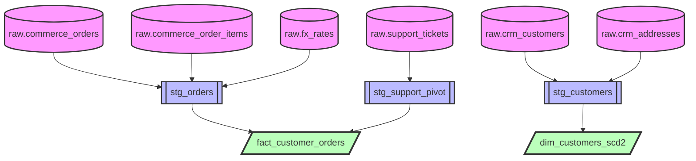

# Data Pipeline Specification - Flow Diagram

Generated from: `spec.json`

## Data Flow



## Model: stg_customers

```mermaid
graph LR
    SRC1[raw.crm_customers]:::source
    SRC2[raw.crm_addresses]:::source
    MODEL[stg_customers]:::model
    OUT[stg_customers<br/>• customer_id<br/>• email<br/>• phone_e164<br/>• lifecycle_stage<br/>• country<br/>• city<br/>• state<br/>• postal_code<br/>• created_at]:::output

    SRC1 -->|LEFT| MODEL
    SRC2 -->|| MODEL
    MODEL --> OUT

    classDef source fill:#e1f5ff,stroke:#01579b,stroke-width:2px
    classDef model fill:#fff9c4,stroke:#f57f17,stroke-width:3px
    classDef output fill:#c8e6c9,stroke:#2e7d32,stroke-width:2px
```

## Model: stg_orders

```mermaid
graph LR
    SRC1[raw.commerce_orders]:::source
    SRC2[raw.commerce_order_items]:::source
    SRC3[raw.fx_rates]:::source
    MODEL[stg_orders]:::model
    OUT[stg_orders<br/>• order_id<br/>• customer_id<br/>• order_ts<br/>• amount_usd<br/>• items<br/>• refund_usd]:::output

    SRC1 -->|LEFT| MODEL
    SRC2 -->|LEFT| MODEL
    SRC3 -->|| MODEL
    MODEL --> OUT

    classDef source fill:#e1f5ff,stroke:#01579b,stroke-width:2px
    classDef model fill:#fff9c4,stroke:#f57f17,stroke-width:3px
    classDef output fill:#c8e6c9,stroke:#2e7d32,stroke-width:2px
```

## Model: stg_support_pivot

```mermaid
graph LR
    SRC1[raw.support_tickets]:::source
    MODEL[stg_support_pivot]:::model
    OUT[stg_support_pivot<br/>• open_tickets<br/>• closed_tickets]:::output

    SRC1 -->|| MODEL
    MODEL --> OUT

    classDef source fill:#e1f5ff,stroke:#01579b,stroke-width:2px
    classDef model fill:#fff9c4,stroke:#f57f17,stroke-width:3px
    classDef output fill:#c8e6c9,stroke:#2e7d32,stroke-width:2px
```

## Model: fact_customer_orders

```mermaid
graph LR
    SRC1[stg_orders]:::source
    SRC2[stg_support_pivot]:::source
    MODEL[fact_customer_orders]:::model
    OUT[fact_customer_orders<br/>• order_count<br/>• total_spent_usd<br/>• aov_usd<br/>• total_refund_usd<br/>• first_order_ts<br/>• last_order_ts<br/>• open_tickets<br/>• closed_tickets]:::output

    SRC1 -->|| MODEL
    SRC2 -->|| MODEL
    MODEL --> OUT

    classDef source fill:#e1f5ff,stroke:#01579b,stroke-width:2px
    classDef model fill:#fff9c4,stroke:#f57f17,stroke-width:3px
    classDef output fill:#c8e6c9,stroke:#2e7d32,stroke-width:2px
```

